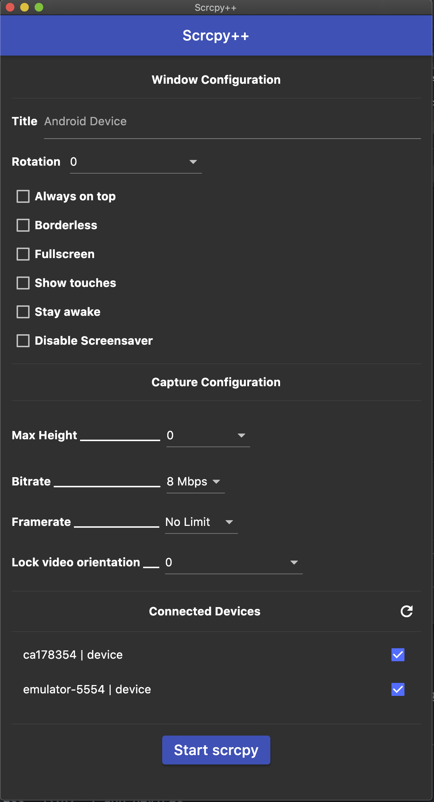

# SCRCPY++ GUI

### Introduction to scrcpy

[Scrcpy](https://github.com/Genymobile/scrcpy) was created by the team behind the popular Android emulator Genymotion, but it is not an Android emulator itself, it displays and controls Android devices connected via USB or TCP/IP, it does not require any root access. It works with GNU/Linux, Windows, and MacOS.

Scrcpy works by running a server on your Android device, and the desktop application communicates using USB (or using ADB tunneling wireless). The server streams the H.264 video of the device screen. The client decodes the video frames and displays them. The client captures input (keyboard and mouse) events, sends them to the server, and the server injects them into the device. [The documentation](https://github.com/Genymobile/scrcpy/blob/master/DEVELOP.md) provides more details.

If you want to see your Android screen interact with the app or content on your desktop, record your phone screen or perform other basic tasks, then Scrcpy is a good choice.

In short, Scrcpy is an excellent way to easily view your Android screen on your computer and interact with it in real time.

### Introduction to scrcpy++ GUI

SCRCPY++ GUI was developed to simplify and speed up use of scrcpy by providing a gui with easily selectable devices and options in comparison to the CLI nature of scrcpy

### Requirements

The Android device requires at least API 21 (Android 5.0).

Make sure you enabled adb debugging on your device(s).

On some devices, you also need to enable an additional option to control it using keyboard and mouse.

[Scrcpy](https://github.com/Genymobile/scrcpy) must be installed and accesible through terminal (in PATH) using scrcpy command.

__adb__ must be installed and accesible through terminal (in PATH) using adb command.

Screenshot: 

